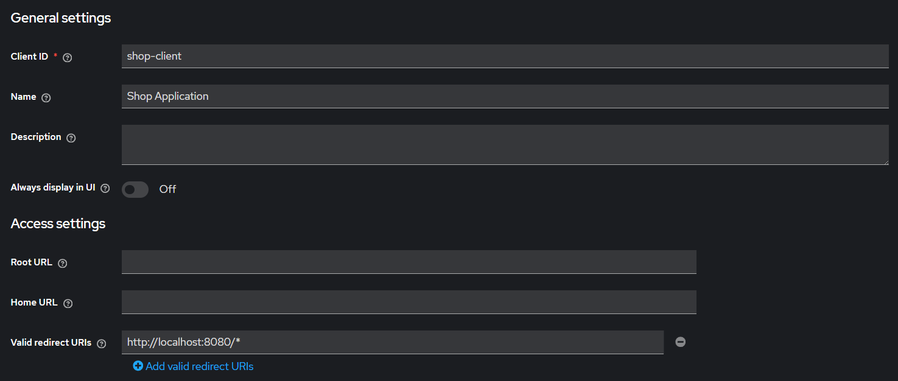
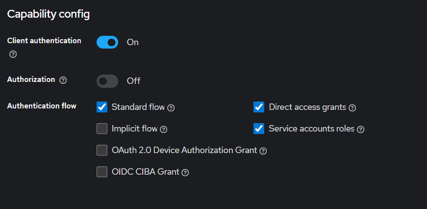

Простое веб-приложение витрины интернет магазина, реализованное с использованием Spring Framework и завёрнутое в Docker

Приложение в четырёх контейнерах:
1) Сервис платежей
2) Основное приложение, состоящее из шести основных частей (модулей): страница витрины товаров, доступных для просмотра
и покупки; страница товара; страница корзины покупателя; страница всех заказов; страница заказа; сервис покупки.\
3) Redis для кеширования
4) Keycloak для межсервисной авторизации 

В качестве кеша приложение использует Redis, подключение которого полностью настроено в конфигах приложения и
файле docker-compose

## Сборка и запуск

### 1. Клонирование репозитория

```bash 
git clone https://github.com/yjailbir/shop-app-yandex-practicum-sprint-5
```

### 2. Настройка свойств приложения

В файле src/main/resources/application.properties заполнить все поля:
- spring.r2dbc.url={url вашей базы данных (если это не h2, то нужно добавить в pom.xml зависимость на соответствующий драйвер)}
- spring.r2dbc.username={имя пользователя вашей базы данных (Если база h2, то значение может быть любым)}
- spring.r2dbc.password={пароль вашей базы данных (Если база h2, то значение может быть любым)}
- values.img_folder={полный путь к папке, где будут храниться изображения карточек товаров}

ВАЖНО: приложение работает на реактивном стеке. Будьте внимательны при подключении драйвера БД. Убедитесь, что выбранная
вами БД поддерживает реактивный подход.

Если приложение должно работать на не embedded БД, то в отдельно нужно настроить volumes для Docker, иначе при перезапуске
приложения все данные будут теряться.

### 3. Сборка JAR-файлов

Выполнить в каталоге payment-service команду

```bash
./mvnw package
```

В результате сборки будет создан файл:  
`target/openapi-spring-1.0.0.jar`

Далее выполнить в каталоге shop-application команду

```bash
./mvnw package -Dmaven.test.skip=true
```
В результате сборки будет создан файл:  
`target/main-shop-app-0.0.1-SNAPSHOT.jar`

#### Важно
При сборке основного модуля тесты отключены, потому что интеграционные тесты обращаются в первому сервису.
Если есть необходимость собирать с тестами, то openapi-spring-1.0.0.jar должен быть запущен.

### 3. Сборка образа и запуск контейнеров

Выполнить в корне проекта команду

```bash
docker-compose up --build
```

После выполнения этих команд приложение будет доступно по адресу http://localhost:8080/shop

### 4. Настройка сервера авторизации
После запуска контейнеров нужно перейти по адресу http://localhost:8081

Дефолтные данные для входа: admin/password прописаны docker-compose.yml файле
После входа нужно добавить клиента для межсервисного взаимодействия
(https://www.keycloak.org/docs/latest/server_admin/index.html#assembly-managing-clients_server_administration_guide)

И заполнить значения в обоих application.yml файлах.

Вот настройки для текущих значений:



При таких настройках нужно только поменять значение свойства client-secret в application.yml основного сервиса.
Найти его можно в Clients->shop-client->Credentials->Client Secret
